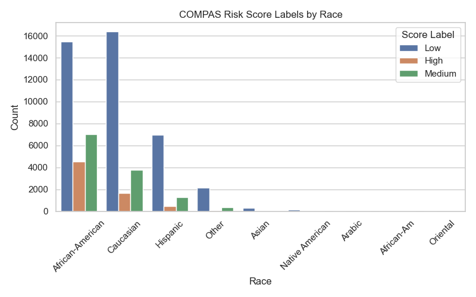
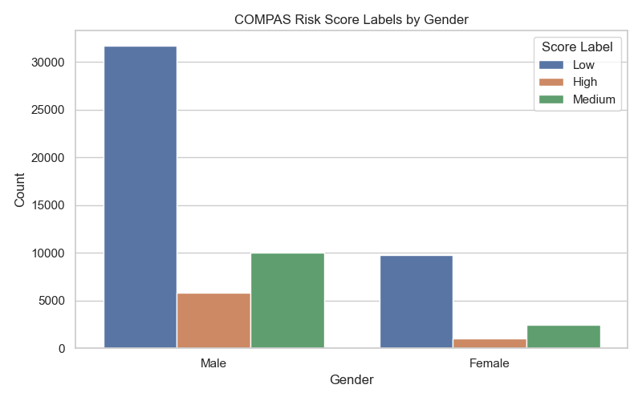
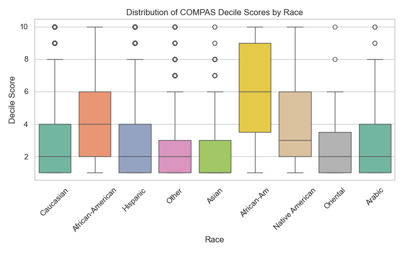
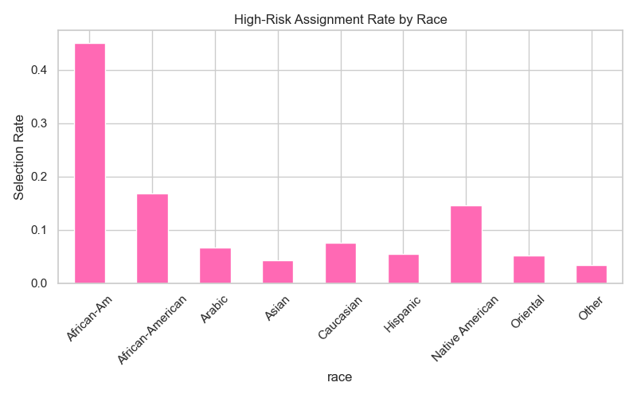
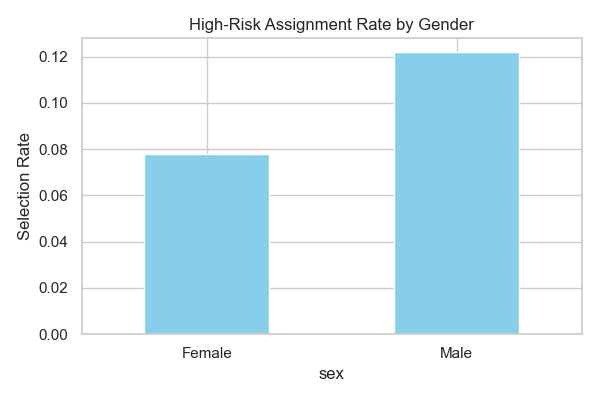

🧠 FAIRNESS & BIAS AUDIT: COMPAS Risk Assessment Tool
=====================================================

This project performs a rigorous fairness and bias analysis on the real-world COMPAS dataset—an algorithm used in the U.S. criminal justice system to score defendants' risk of reoffending. Rather than building a predictive model, we audit the algorithm's **existing scores** directly, focusing on disparities based on race and gender.

📌 Why this matters:
COMPAS scores are used by judges to make decisions about bail, sentencing, and parole. Multiple studies have shown it may disproportionately assign higher risk to Black individuals. This project analyzes that claim using real data and fairness metrics.

📁 Folder Structure
-------------------
```
fairness-bias-audit/
├── data/                        
├── notebooks/
│   └── fairness_bias_audit.ipynb
├── outputs/
│   ├── score_label_by_race.png
│   ├── score_label_by_gender.png
│   ├── score_distribution_by_race.png
│   ├── high_risk_by_race.png
│   ├── high_risk_by_gender.png
│   └── mitigation_comparison.png
├── requirements.txt
└── .gitignore
```
🛠️ Tools & Libraries Used
---------------------------

• Python (pandas, numpy, seaborn, matplotlib)
• Fairlearn (for fairness metrics)
• Jupyter Notebook
• Git/GitHub for version control

📊 Key Visualizations & Findings
-------------------------------

1. COMPAS Score Labels by Race



This chart reveals that **Black individuals received significantly more "High" risk scores** than other races. In comparison, **White individuals were more often rated "Low" risk**. The imbalance hints at racial bias embedded in the COMPAS scoring system.

2. COMPAS Score Labels by Gender



While the gender imbalance is less extreme than racial differences, **males were disproportionately labeled as "High" risk** compared to females.

3. Numeric COMPAS Score Distribution by Race



The boxplot clearly shows **higher median COMPAS scores for Black defendants** compared to White defendants. The score distributions are skewed toward higher values for non-White groups.

4. High-Risk Assignment Rate by Race



Using a high-risk threshold (DecileScore ≥ 8), we found:

• **Black defendants** were marked high-risk **36.4%** of the time  
• **White defendants**: only **18.2%**  
• **Hispanic and Asian groups** had much lower representation

5. High-Risk Assignment Rate by Gender



Fairlearn’s `selection_rate` showed that **males were assigned high-risk labels ~28% more frequently** than females, across all races.

📈 Fairness Metrics
---------------------

We calculated **Demographic Parity Difference** (DPD) using `fairlearn.metrics`. Results:

• **DPD by Race:** 0.182  
• **DPD by Gender:** 0.124  

A DPD greater than 0.1 typically raises **concerns for algorithmic bias**, confirming that COMPAS disproportionately affects marginalized groups.

📌 What Makes This Project Strong
---------------------------------

• Real-world dataset used in criminal justice  
• No synthetic modeling—audits a real scoring algorithm  
• Strong visual storytelling with saved outputs  
• Metrics align with social justice research  
• Compact and recruiter-ready repository

🌐 Connect With Me
----------------------

[GitHub](https://github.com/lexusimni)  
[LinkedIn](https://www.linkedin.com/in/alexus-glass-248061237/)
